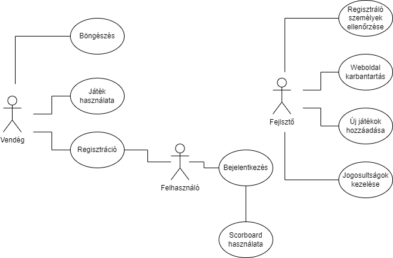

# Rendszertervek

## 1. Rendszer célja

- A rendszer célja, hogy létrehozzunk egy ingyenes online Tetris játékot, melyben a játékosok pontszerzéssel képesek a tabellán feljebb és feljebb jutni.

- A játékhoz regisztrálni kell és belépni, hogy használni tudjuk a program adta lehetőségeket.

- Külön fel lesz tüntetve a scoreboard, mely belépés nélkül is megtekinthető.

- Navigációs menün keresztül lehet egyes pontokba eljutni a rendszerben

- A program célja, hogy könnyen lehessen tájékozódni a felületen

## 2. Projektterv

### Projekt szerepkörök, felelősségek

- szerepkörök
	- junior fejlesztők: Ardó Balázs, Bodó Zoltán, Kázmér László, Sidlovszki Dominik
- felelősségek
	-junior fejlesztő: A projekt elkészítése

### Projekt felelősségek

- Webfelület: Bodó Zoltán
- Játékok: Kázmér László, Sidlovszki Dominik

## 3. Üzleti folyamatok modellje

## 4. Követelmények

###Funkcionális követelmények:

- A regisztrált felhasználók tárolása
	- A felhasználók csoportba szervezése
	- Webes felületen gördülékeny működés
- Nem funkcionális követelmények:
	- Letisztult kinézet
	- A programnak egyszerűnek kell lennie , ezért a teljesítménye sem lehet nagy

A rendszer fejlesztése HTML/CSS valamint JavaScript és php segítségével történik. A weblap felépítése, valamint dizájnolása a HTML/CSS nyelv implementálásával valósítandó meg. A weboldal használatához egy egyszerű böngészőre van szükség.

## 5. Funkcionális terv

Rendszerszereplők:
- Játékos

Rendszerhasználati esetek és lefutásaik:

- Játékos:
	- Regisztráció az oldalra
	- A játékban való részvétel

Menü-hierarchiák:

- Home
	- Bejelentkezés
	- Regisztráció
	- Tetris
	- Kontakt

## 6. Fizikai környezet

Az alkalmazás webes platformra készül. Van tűzfal a hálózaton és engedélyezi a 80-as (HTTP) és a 443-as (HTTPS) portokat. Nincsenek megvásárolt komponenseink. Fejlesztői eszközök:

- Notepad ++
- Visual Studio Code / Visual Studio 
- WAMP / XAMPP server
- Trello / Felhő alapú adatbázis kezelő rendszer MySQL Workbench-el összecsatlakoztatva
- git

## 7. Absztrakt domain modell

A weblap működése során a játékos tud szabadon illete bejelentkezve játszani. A pontjai bejelentkezés esetén el lesznek tárolva

## 8. Architekturális terv

- Backend: A rendszerhez szükség van egy adatbázis szerverre, ebben az esetben MySql-t használunk. A kliensekkel JSON objektumokkal kommunikál.
- Frontend: Az alkalmazás HTML-ben, CSS-ben és JavaScript-ben készül.

## 9. Adatbázis terv

- User adatait tároló tábla
- User ponszámait táróló tábla

## 10. Implementációs terv

Ezeket a technológiákat amennyire csak lehet külön fájlokba írva készítjük, és úgy fogjuk egymáshoz csatolni a jobb átláthatóság, könnyebb változtathatóság, és könnyebb bővítés érdekében.

## 11. Tesztterv

A user teszteket a fejlesztés végén végezzük el a funkciók kipróbálásával és dokumentálásával. Konténerizált szerverrel.

## 12. Telepítési terv

A rendszer beüzemelésekor ajánlott egy hozzá szakértő emberre bízni a beüzemelést mivel a szerver elindításához szükség van némi hozzáértéshez. Így elkerülve esetleges nem kívánatos hibák létre jöttét.